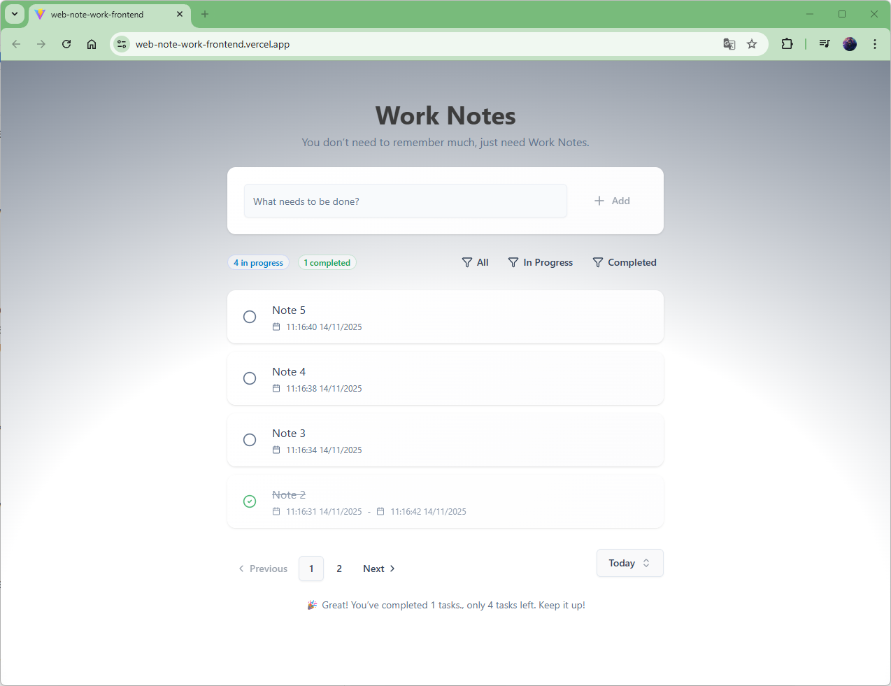

# Work Notes

Work Notes is a modern and responsive task management application designed to help you keep track of your work. Add, manage, and filter your tasks with a clean and intuitive interface.

## Features

-   **Create Tasks**: Quickly add new tasks through a simple input field.
-   **Update & Delete**: Easily edit task titles or remove them completely.
-   **Task Status**: Toggle tasks between "in progress" and "completed" with a single click.
-   **Powerful Filtering**:
    -   Filter tasks by their status: all, in progress, or completed.
    -   Filter tasks by date range: Today, Week, Month, or All Time.
-   **Task Statistics**: View a summary of your active and completed tasks.
-   **Pagination**: Navigate through your task list with easy-to-use pagination.
-   **Responsive Design**: A seamless experience across desktop and mobile devices.
-   **Toast Notifications**: Get instant feedback for your actions (add, update, delete).

## Tech Stack

-   **Framework**: React 19
-   **Build Tool**: Vite (with Rolldown)
-   **Styling**: Tailwind CSS
-   **UI Components**: shadcn/ui
-   **Icons**: Lucide React
-   **HTTP Client**: Axios
-   **Routing**: React Router
-   **Notifications**: Sonner

## Getting Started

Follow these instructions to get a local copy of the project up and running.

### Prerequisites

-   Node.js (v18 or later)
-   npm or a compatible package manager

### Installation

1.  **Clone the repository:**
    ```bash
    git clone https://github.com/dangdinh2405/web-note-work-frontend.git
    cd web-note-work-frontend
    ```

2.  **Install dependencies:**
    ```bash
    npm install
    ```

3.  **Set up environment variables:**

    Create a `.env` file in the root of the project and add the URL for the backend API server. This is required for the application to fetch and manage tasks.

    ```env
    VITE_API_URL=http://your-backend-api-url.com
    ```

### Running the Application

-   **Start the development server:**
    ```bash
    npm run dev
    ```
    The application will be available at `http://localhost:5173`.

## Available Scripts

-   `npm run dev`: Starts the development server with Hot Module Replacement.
-   `npm run build`: Builds the application for production.
-   `npm run lint`: Lints the source files using ESLint.
-   `npm run preview`: Serves the production build locally to preview it.

## Demo

